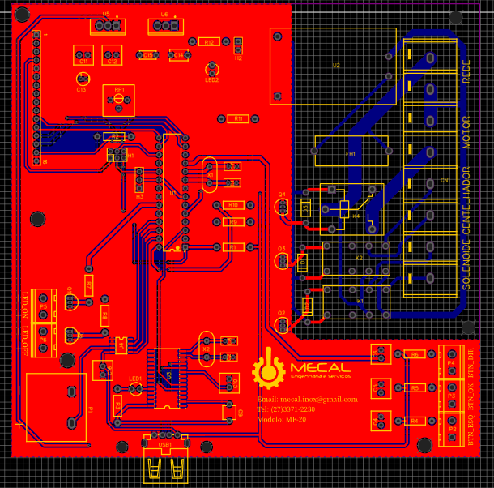

# Sistema de controle e coleta de temperatura para controle da torra de amêndoas de cacau.
O sistema foi desenvolvido para ser instaldo em fornos já comercializadas pela empresa MECAL engenharia. 
O dispositivo controla a rotação do tambor onde ficam as amêndoas e a válvula solenóide do gás. 
O ususário define as temperaturas limites que o forno deve atingir, qunado o forno atinge a temperatura máxima, o gás é fechado, ficando somente o tambor girando até as amêndoas esfriarem e chegarem na temperatura mínima definida pelo usuário e após isso o tambor é desligado e o processo encerrado. 

O usuário pode coletar dados da teperatura da torra através de um dispositivo de armazenamento usb, e após a coleta, pode usar o software fornecido para gerar o gráfico da temperatura VS tempo.

